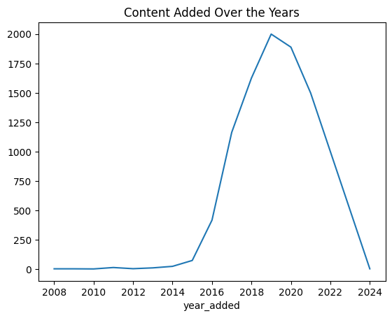
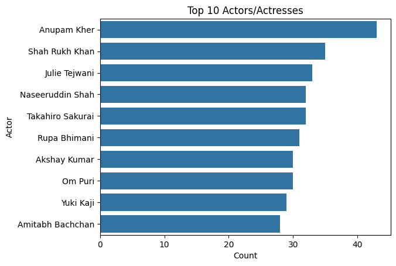
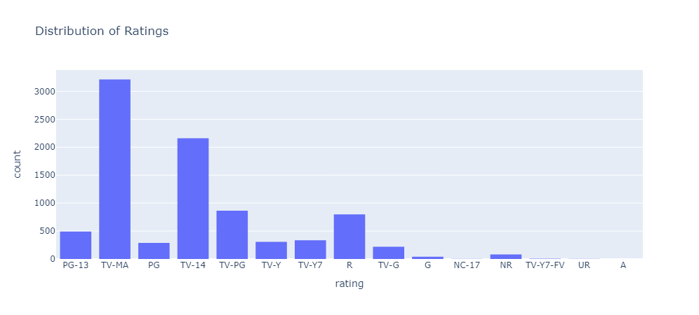

# Netflix Analysis

## 📌 Project Overview
This project analyzes the **Netflix Titles Dataset**, focusing on **data cleaning, preprocessing, and visualizations** to uncover insights about Netflix's content.

## 🚀 Features
- Data Cleaning & Handling Missing Values
- Exploratory Data Analysis (EDA) with Visualizations
- Trend Analysis on Netflix's Content Catalog
- Insights on Movie & TV Show Releases Over Time
- Genre and Country-based Analysis
- **Recommendation Engine for Personalized Content Suggestions**

## 📂 Dataset
- **Source:** Netflix Titles Dataset (`netflix_titles.csv`)
- **Columns:** Title, Director, Cast, Country, Release Year, Rating, Duration, etc.

## 🛠️ Installation & Setup
1. Clone the repository:
   ```bash
   git clone https://github.com/your-username/netflix-analysis.git
   cd netflix-analysis
   ```
2. Run the Jupyter Notebook:
   ```bash
   jupyter notebook netflix_titles.ipynb
   ```

## 🤖 Recommendation Engine
The project includes a **content-based recommendation engine** that suggests similar movies and TV shows based on genres, cast, and other metadata.

### Sample Code for Recommendations:
```python
from sklearn.feature_extraction.text import TfidfVectorizer
from sklearn.metrics.pairwise import cosine_similarity

def get_recommendations(title, df):
    tfidf = TfidfVectorizer(stop_words='english')
    tfidf_matrix = tfidf.fit_transform(df['description'].fillna(''))
    cosine_sim = cosine_similarity(tfidf_matrix, tfidf_matrix)
    indices = pd.Series(df.index, index=df['title']).drop_duplicates()
    idx = indices[title]
    sim_scores = list(enumerate(cosine_sim[idx]))
    sim_scores = sorted(sim_scores, key=lambda x: x[1], reverse=True)
    sim_scores = sim_scores[1:6]
    return df['title'].iloc[[i[0] for i in sim_scores]]
```

## 📊 Screenshots
Here are some visual insights from the analysis:





## 📜 License
This project is licensed under the MIT License.

---
**Author:** Anas Waleed Tahir

**GitHub:** [anasengence](https://github.com/anasengence/Netflix_Analysis_Project/)
